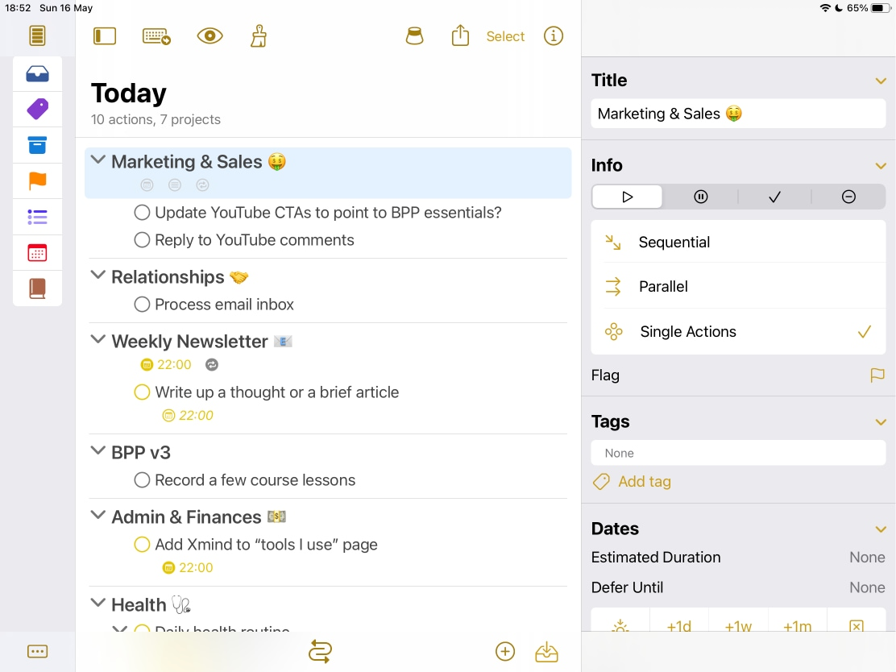
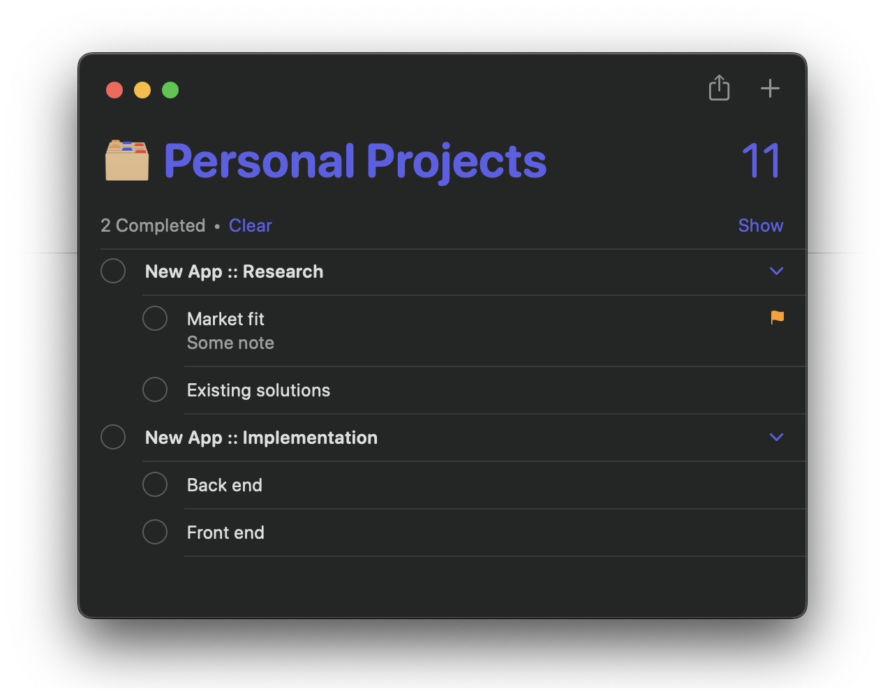
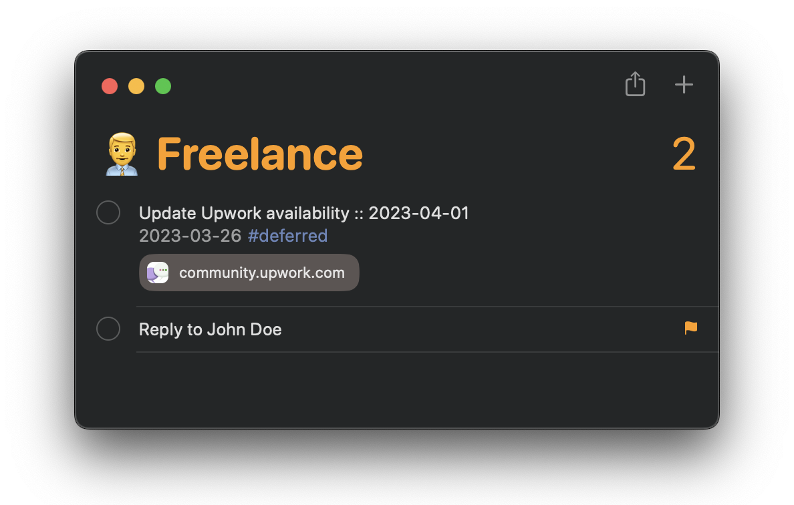

# Apple Reminders GTD

## Reasoning

For the longest time I have been a big [GTD](https://gettingthingsdone.com) fan and a
devoted [OmniFocus](https://www.omnigroup.com/omnifocus/) user. However, I have never
liked the aesthetics of OmniFocus. In fact, someone mentioned that it looks like a
database manager, and now I cannot un-see it. Aesthetics in the tools I use is important
to me. In addition, I prefer to use Apple-native tools whenever possible — I use
Apple Calendar, Apple Mail (and iCloud as a mail provider), etc. However, other than
for very light-duty tasks, I don't use Apple Notes nor Apple Reminders... until
recently.

I decided to give Apple Reminders a shot as a GTD app and an OmniFocus replacement for
several reasons. First, the aforementioned aesthetics. The OmniGroup has not done
anything to address the visual appeal of the app in the new release. Second, for
Reminder's better integration into the Apple ecosystem. And last, but not least, for
the greater simplicity compared to OmniFocus.

## GTD Requirements

When designing my Apple Reminders GTD system, I first had to list out the
characteristics of my current OmniFocus-based system that were most important to me.

### Task-Level Functionality
- Due dates
- ["Next" tag](https://www.youtube.com/watch?v=WV6geLyo5zE)
- The combination of deferred date and next tag, where the task only becomes available
  on the deferred date and then is automatically tagged with next
- The combination of deferred date, next tag, and a due date
- Attaching notes to the tasks
- Repetition options
  - For recurring tasks such as "allocate savings", that I call "maintenance tasks"

### Project-Level Functionality
- Folders within folders
- Arbitrary number of indentation levels for sub-tasks
- Making tasks sequentially available

### Other Functionality
- Weekly reviews

## Implementation

Some requirements are already present in Apple Reminders, such as due dates and task
notes. Also, Reminders already has a robust repetition system, but it is centered around
due dates. In OmniFocus, I have my "allocate savings" maintenance task set to become
available on the first Monday of every month and be due at the end of that week. This
is something that I currently only approximate with my new system.

Also, the Reminders app does not allow arbitrary folder nesting, nor does it allow
arbitrary tasks nesting. For the current projects and tasks I have set up, this is not
a limitation, but should it become one, I will experiment with adding a prefix to  the
next level of nested tasks.

For example, if I am building a new app and I want to partition that project into
a research task and an implementation task, both of which have sub-tasks, I could do
something like this:

Another requirement I have not gotten around to tackling yet is making tasks
sequentially available. This is not something I need very often, so I suspect manually
maneging that won't be too much of a burden.

### Deferred Date and Next Tag

For deferred date and next tag, the system is a follows. First, tasks that
are currently available to work on, I flagg. This makes them available in the flagged
list in Reminders. Next, tasks that are deferred, I tag with the `#deferred` tag and I
set a due-date. This is the date on which they will become available. Of course,
I won't manage that manually, so I put together a Shortcuts workflow for the next
step. The workflow finds all reminders that have a `#deferred` tag and a past due date.
It then removes both and flags the reminder, making it available to work on.

If I want to defer a task, but also have a due-date, in addition to flagging the task
and adding the deferred date as a due-date, I set the actual due-date directive as part
of the title of the reminder like `Some reminder :: YYYY-MM-DD`. The Shortcuts workflow
will then remove the tag and will replace the already past "defer" date by the
title-encoded actual due-date.

I have dumbed-down my "allocate savings" maintenance task to only use a repeating
due-date for the end of each first week of the month instead. I also tag maintenance
tasks with a `#maintenance` tag to make it immediately obvious what they are.

Here is a link to the Shortcuts workflow: https://www.icloud.com/shortcuts/75b1ebe624bc484f828f93790c8416e4

### Weekly Reviews

To remind myself to perform weekly reviews, I first added a new list called "Meta"
that I will use for this and any other similar meta tasks. In it, I added a task called
"Review" that is set to repeat weekly. In addition, I set up a smart Review list that
displays all tasks tagged with a `#review` tag. Finally, I put together another two
Shortcuts workflows. The first checks if the Review task in the Meta list is due.
If it is, it checks it as done, which re-sets the due date to next week, and runs the
second workflow. The second workflow then fetches all tasks that are not yet completed
and adds the `#review` tag to them.

For now, I review mostly by going list by list, checking/adjusting the tasks, selecting
all of them, and removing the `#review` tag in batch. I mostly use the "Review" list
as a way to ensure I have not missed any tasks at the end of the review session.

Here is are the links to the two Shortcuts workflows:

Review due checker: https://www.icloud.com/shortcuts/1d59132b23cc43cd9dc43df17fd9bb56

Review task tagger: https://www.icloud.com/shortcuts/33272b8b7675454a901f60f5e9655ee6

## Putting It All Together

Finally, to automate the launching of these shortcuts, on my Mac, I have created a
separate shortcut that runs the deferred-tasks shortcut and the review-due-checker.
On my iOS devices, this is an Automation that is set to run each time the Reminders
app is opened.

I have been using this system for the past couple of weeks, and I am loving it. In
addition to the added simplicity, I like that the reminders for the Reminder app work
much better than the ones for OmniFocus. For instance, if I mark a task as done on one
device, all other devices will immediately remove that notification. The location-based
reminders also work much better here.

Overall, I think I will stick to this system for a while. There is no doubt that it
will evolve with time, but I intend to keep this repo up to date as that happens.
